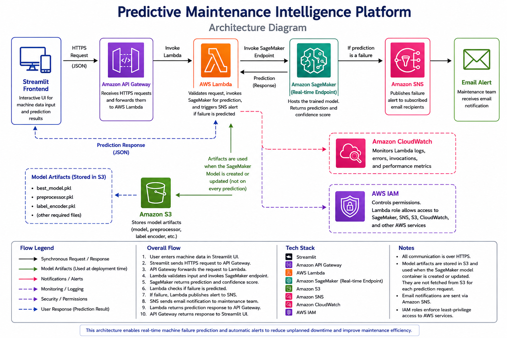
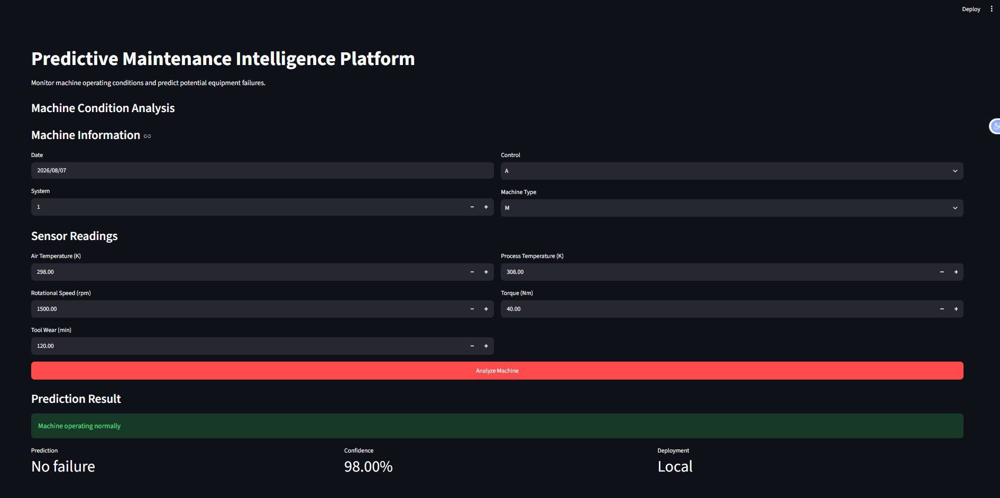
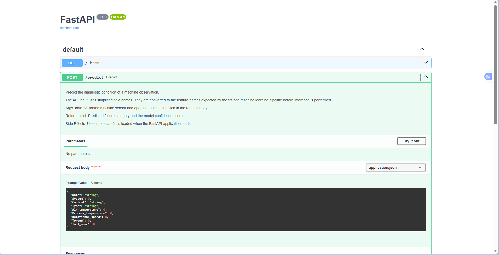
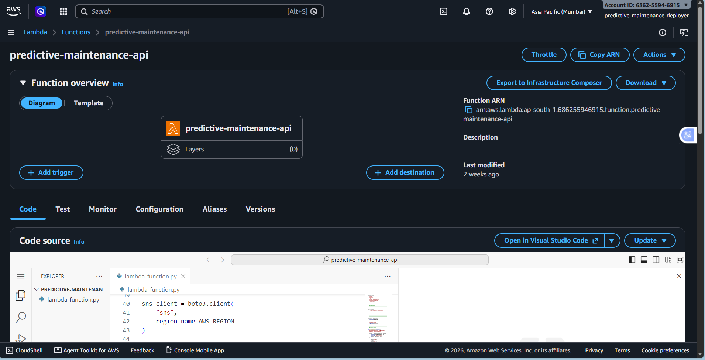
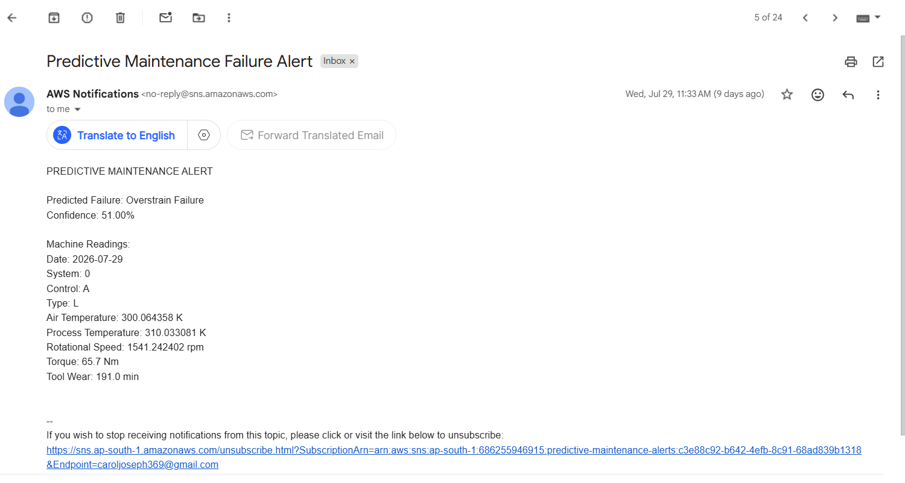

# Predictive Maintenance Intelligence Platform


An end-to-end predictive maintenance platform that predicts industrial machine failures from operational and sensor data using Machine Learning, FastAPI, Streamlit, and AWS SageMaker.

This project began as a notebook-based machine learning workflow and evolved into a production-style prediction system. It includes a Random Forest classification model, reusable preprocessing and inference modules, a local FastAPI service, an interactive Streamlit frontend, and an AWS deployment using SageMaker, Lambda, API Gateway, SNS, S3, CloudWatch, and IAM.

Rather than focusing only on model accuracy, the project emphasizes the complete engineering workflow—from messy industrial data and feature engineering to cloud deployment and a user-facing application.

---

## Key Features

- End-to-end machine learning pipeline
- Real-world industrial predictive maintenance use case
- Random Forest classification model
- Feature engineering and preprocessing pipeline
- FastAPI REST API
- Interactive Streamlit frontend
- AWS SageMaker deployment
- AWS Lambda orchestration
- API Gateway integration
- SNS email alerts
- Model explainability using Feature Importance and SHAP

---

## What the Project Does

The system accepts machine information such as temperature, rotational speed, torque, tool wear, machine type, system information, control category, and timestamp data.

It predicts one of six diagnostic conditions:

- No failure
- Heat Dissipation Failure
- Overstrain Failure
- Power Failure
- Tool Wear Failure
- Random Failures

The Streamlit frontend allows a user to enter machine information and sensor readings through an interactive interface.

When the user selects **Analyze Machine**, the application sends the readings as a JSON request to the deployed API Gateway endpoint.

API Gateway invokes Lambda, which validates the request and sends the machine data to a SageMaker real-time endpoint for prediction.

If the model predicts a failure, Lambda publishes an SNS notification that can be delivered through email.

If the prediction is `No failure`, no alert is sent.

The prediction, confidence score, and alert status are returned through API Gateway and displayed in the Streamlit interface.

---

## System Architecture



The final application request flow is:

```text
Streamlit Frontend
        ↓
HTTP POST /predict
        ↓
API Gateway
        ↓
Lambda
        ↓
SageMaker Real-Time Endpoint
        ↓
Random Forest Prediction
        ↓
Lambda
   ┌────┴─────────────┐
   ↓                  ↓
Failure            No Failure
   ↓                  ↓
SNS Alert           No Alert
   ↓
Email
   │
   └──────────┐
              ↓
        API Response
              ↓
      Streamlit Frontend
              ↓
 Prediction + Confidence
      + Alert Status
```

S3 stores the packaged model artifacts used when the SageMaker model is deployed.

CloudWatch records Lambda executions and provides operational logging.

IAM controls permissions between AWS services.

The model itself was trained locally. SageMaker is used for managed real-time inference rather than model training.

---

## Screenshots

### Streamlit Dashboard – Failure Detection


### Streamlit Dashboard – Normal Operation


### FastAPI Interactive Documentation


### AWS Lambda Deployment


### SNS Email Alert


## Dataset

The project uses the AI4I-PMDI predictive-maintenance dataset with **10,000 machine observations**.

The main inputs are:

- Air temperature
- Process temperature
- Rotational speed
- Torque
- Tool wear
- Machine type
- System
- Control
- Date

The target is `Diagnostic`.

### Class Distribution

| Diagnostic Class | Samples |
|---|---:|
| No failure | 9,652 |
| Heat Dissipation Failure | 106 |
| Overstrain Failure | 98 |
| Power Failure | 83 |
| Tool Wear Failure | 42 |
| Random Failures | 19 |

One of the biggest challenges in this project is the class imbalance.

More than 96% of the observations belong to `No failure`, while some failure classes contain fewer than 50 examples.

Because of that, I did not rely only on accuracy when evaluating the model.

---

## Data Preparation

The original data contained a large amount of missing sensor information, so I kept the raw and processed datasets separate.

```text
data/raw/AI4I-PMDI.csv
data/processed/cleaned_data.csv
```

During data understanding and cleaning I checked:

- missing values
- data types
- duplicates
- unusual sensor values
- feature distributions
- outliers
- target imbalance

The raw dataset is kept unchanged so the cleaning process remains reproducible.

---

## Feature Engineering

I added two machine-related features.

### Temperature Difference

```text
Process temperature - Air temperature
```

This represents the temperature difference between the machine process and the surrounding environment.

### Power Index

```text
Rotational speed × Torque
```

This is a simple engineered measure of machine operating load.

`Power_Index` later became the most important feature in the Random Forest feature-importance analysis.

The `Date` column is also converted into:

```text
Year
Month
Day
Day_of_Week
Quarter
```

The original timestamp is removed after these values are generated.

This is also why production prediction requests still require `Date`: the inference code needs it to recreate the same features that were used during training.

---

## Preprocessing

I built the preprocessing stage using a scikit-learn `ColumnTransformer`.

Numerical features use:

```text
Median Imputation
        ↓
StandardScaler
```

Categorical features use:

```text
Most-Frequent Imputation
        ↓
OneHotEncoder
```

The preprocessor is fitted only on the training data and then saved.

The same fitted preprocessor is reused during inference instead of rebuilding preprocessing separately.

This keeps the transformation logic consistent between training and production prediction.

---

## Model Development

I compared several classification algorithms:

- Logistic Regression
- Decision Tree
- Random Forest
- K-Nearest Neighbors
- Support Vector Machine
- Gradient Boosting
- XGBoost

Random Forest gave the best balance for the final workflow and was selected as the production model.

I also experimented with Random Forest hyperparameter tuning and SMOTE.

Neither experiment gave enough improvement to justify replacing the baseline Random Forest, so I kept them as experiments instead of automatically using the more complicated approach.

---

## Model Performance

The final model was evaluated on a stratified 20% test split.

| Metric | Score |
|---|---:|
| Accuracy | **0.9925** |
| Macro F1 | **0.6572** |
| Weighted F1 | **0.9897** |

The accuracy looks excellent at first, but it needs context.

The model performs extremely well on the dominant `No failure` class and several failure classes, but the rarest classes remain difficult to detect.

Two minority classes had zero recall on the test split.

Therefore, I would **not** describe this model as "99.25% reliable at detecting machine failures."

The more important weakness is visible in the Macro F1 score of **0.6572**.

That class-imbalance problem is one of the main limitations of the current model.

---

## Explainability

I used Random Forest feature importance and experimented with SHAP to better understand what the model was learning.

The most important production-model features included:

| Rank | Feature | Importance |
|---|---|---:|
| 1 | Power Index | 0.2175 |
| 2 | Torque | 0.1530 |
| 3 | Rotational speed | 0.1470 |
| 4 | Tool wear | 0.1278 |
| 5 | Temperature Difference | 0.0854 |
| 6 | System | 0.0482 |

These values show which features the Random Forest used most heavily.

They should not be interpreted as proof that those features cause machine failures.

The SHAP experiments are available in:

```text
notebooks/09_Model_Explainability.ipynb
```

---

## From Notebooks to Reusable Code

The first part of the project was developed through notebooks for data exploration and experimentation.

After the modelling stage, I moved the main workflow into reusable modules under `src/`.

```text
src/
├── config.py
├── data_loader.py
├── explainability.py
├── feature_engineering.py
├── model_evaluator.py
├── model_trainer.py
├── pipeline.py
├── predict.py
├── preprocessing.py
└── utils.py
```

The training pipeline can be run with:

```bash
python -m src.pipeline
```

It handles:

```text
Data Loading
    ↓
Feature Engineering
    ↓
Train/Test Split
    ↓
Preprocessing
    ↓
Random Forest Training
    ↓
Evaluation
    ↓
Artifact Saving
```

The saved production artifacts are:

```text
artifacts/
├── best_model.pkl
├── preprocessor.pkl
└── label_encoder.pkl
```

---

## Local FastAPI Interface

Before connecting the project to AWS, I created a small FastAPI interface for local prediction testing.

Run it from the project root with:

```bash
uvicorn app.main:app --reload
```

The prediction route is:

```text
POST /predict
```

FastAPI/Pydantic validates the request and converts it into the structure expected by the prediction pipeline.

This local API is mainly useful for development and local testing.

The deployed cloud application uses API Gateway and Lambda instead.

---

# Streamlit Frontend

The final application includes an interactive Streamlit frontend located at:

```text
frontend/streamlit_app.py
```

The frontend allows users to enter machine information and sensor readings without manually constructing API requests.

The interface collects:

```text
Machine Information
├── Date
├── System
├── Control
└── Machine Type

Sensor Readings
├── Air Temperature
├── Process Temperature
├── Rotational Speed
├── Torque
└── Tool Wear
```

The categorical inputs match the categories used by the training data:

```text
Control: A / B / C
Machine Type: L / M / H
```

When the user clicks:

```text
Analyze Machine
```

Streamlit creates a JSON payload and sends an HTTP POST request to the deployed API Gateway `/predict` endpoint.

Conceptually:

```text
User Input
    ↓
Streamlit
    ↓
Python Dictionary
    ↓
HTTP POST + JSON
    ↓
API Gateway
    ↓
AWS Prediction Pipeline
```

The frontend uses Python's `requests` library to communicate with API Gateway.

The returned JSON contains:

```text
predicted_failure
confidence
alert_sent
```

The Streamlit interface then displays:

- predicted machine condition
- model confidence
- whether a maintenance alert was sent

For a healthy machine, the application displays:

```text
Machine operating normally

Prediction: No failure
Confidence: ...
Alert Sent: No
```

For a predicted failure, the application displays the failure class and indicates whether an SNS alert was sent.

### Run the Streamlit Application

From the project root with the normal virtual environment activated:

```bash
streamlit run frontend/streamlit_app.py
```

Streamlit starts a local development server, normally available at:

```text
http://localhost:8501
```

The frontend itself runs locally, while predictions are obtained through the deployed AWS backend.

Therefore, the SageMaker endpoint must be available for live cloud predictions.

---

# AWS Deployment

The cloud version uses:

- **Amazon S3** for packaged model storage
- **Amazon SageMaker** for real-time model inference
- **AWS Lambda** for validation and orchestration
- **Amazon API Gateway** for the HTTP prediction endpoint
- **Amazon SNS** for failure email alerts
- **Amazon CloudWatch** for Lambda logs
- **AWS IAM** for service permissions

---

## SageMaker

The model artifacts are packaged into:

```text
model.tar.gz
```

and uploaded to Amazon S3.

The deployment code is located in:

```text
deployment/sagemaker/
├── deploy.py
└── inference.py
```

`inference.py` recreates the same feature-engineering and preprocessing workflow used during training before making a prediction.

The endpoint can be deployed with:

```bash
python deployment/sagemaker/deploy.py
```

The SageMaker deployment follows:

```text
S3 Model Artifact
      ↓
SageMaker Model
      ↓
Endpoint Configuration
      ↓
Real-Time Endpoint
      ↓
InService
```

I used a separate SageMaker environment because the deployed model artifacts were created with scikit-learn 1.4.2 and needed a compatible deployment environment.

The tested deployment environment is documented in:

```text
requirements-sagemaker.txt
```

---

## Lambda

Lambda acts as the orchestration layer of the deployed application.

Its main responsibilities are:

```text
Receive Request
      ↓
Parse JSON
      ↓
Validate Required Fields
      ↓
Invoke SageMaker Endpoint
      ↓
Read Prediction
      ↓
Check Failure Condition
      ↓
Publish SNS Alert if Required
      ↓
Return HTTP Response
```

Lambda communicates with SageMaker and SNS using the AWS SDK for Python, Boto3.

The SageMaker Runtime client invokes the real-time endpoint, while the SNS client publishes maintenance alerts when a failure is predicted.

---

## API Gateway

API Gateway provides the HTTP entry point for the deployed prediction system.

The production route is:

```text
POST /predict
```

The API Gateway route is integrated with the Lambda function:

```text
POST /predict
      ↓
API Gateway
      ↓
Lambda Integration
      ↓
predictive-maintenance-api
```

The connection consists of three important concepts:

```text
Route
  ↓
Integration
  ↓
Permission
```

The **route** defines which HTTP requests are accepted.

The **integration** defines which backend resource API Gateway invokes.

Lambda's resource-based policy grants API Gateway:

```text
lambda:InvokeFunction
```

permission.

The API uses the `$default` stage with automatic deployment enabled.

A successful failure response looks like:

```json
{
  "predicted_failure": "Power Failure",
  "confidence": 1.0,
  "alert_sent": true
}
```

A successful healthy response looks like:

```json
{
  "predicted_failure": "No failure",
  "confidence": 1.0,
  "alert_sent": false
}
```

---

## SNS Failure Alerts

Amazon SNS handles failure notifications.

Lambda checks:

```text
failure_type != "No failure"
```

If true:

```text
Lambda
   ↓
SNS Topic
   ↓
Confirmed Email Subscription
   ↓
Maintenance Alert Email
```

The notification contains the predicted failure type, confidence score, and machine readings.

Healthy predictions do not trigger an SNS notification.

---

## CloudWatch Monitoring

AWS Lambda execution logs are available through Amazon CloudWatch.

The Lambda log group is used to inspect:

- invocation activity
- request IDs
- execution duration
- memory usage
- runtime errors
- debugging information

This provides operational visibility into the serverless prediction layer.

---

# End-to-End Testing

The system was tested at multiple levels.

## Lambda Test

Lambda test events were used to verify:

```text
Lambda
→ SageMaker
→ Prediction
→ Conditional SNS Alert
```

---

## API Gateway Test

The deployed API was tested using an actual HTTP POST request to the API Gateway `/predict` endpoint.

This verified:

```text
HTTP Client
→ API Gateway
→ Lambda
→ SageMaker
→ Lambda
→ API Gateway
→ HTTP Response
```

A failure test returned:

```text
HTTP Status: 200
Prediction: Power Failure
Confidence: 1.0
Alert Sent: true
```

The corresponding SNS email was successfully received.

---

## Streamlit End-to-End Test

The final frontend was tested against the real AWS backend.

### Failure Test

A known Power Failure record produced:

```text
Machine Failure Detected: Power Failure

Prediction: Power Failure
Confidence: 100.00%
Alert Sent: Yes
```

The corresponding SNS maintenance email was received.

This verified:

```text
Streamlit
→ API Gateway
→ Lambda
→ SageMaker
→ Power Failure
→ SNS
→ Email

and

SageMaker
→ Lambda
→ API Gateway
→ Streamlit Result
```

### Healthy Machine Test

A known healthy machine record produced:

```text
Machine operating normally

Prediction: No failure
Confidence: 100.00%
Alert Sent: No
```

No SNS alert was generated.

Together, these tests verified both branches of the final application.

---

# Project Structure

```text
Predictive-Maintenance-Intelligence-Platform/
│
├── app/
│   └── main.py
│
├── artifacts/
│   ├── best_model.pkl
│   ├── label_encoder.pkl
│   └── preprocessor.pkl
│
├── data/
│   ├── raw/
│   │   └── AI4I-PMDI.csv
│   └── processed/
│       ├── cleaned_data.csv
│       └── engineered_data.csv
│
├── deployment/
│   └── sagemaker/
│       ├── deploy.py
│       └── inference.py
│
├── docs/
│   └── architecture.png
│
├── frontend/
│   └── streamlit_app.py
│
├── lambda_app/
│   └── lambda_function.py
│
├── notebooks/
│   ├── 01_Data_Understanding.ipynb
│   ├── 02_Data_cleaning.ipynb
│   ├── 03_EDA.ipynb
│   ├── 04_Feature_Engineering.ipynb
│   ├── 05_Preprocessing.ipynb
│   ├── 06_Model_Building.ipynb
│   ├── 07_Hyperparameter_Tuning.ipynb
│   ├── 08_SMOTE.ipynb
│   └── 09_Model_Explainability.ipynb
│
├── src/
│   ├── config.py
│   ├── data_loader.py
│   ├── explainability.py
│   ├── feature_engineering.py
│   ├── model_evaluator.py
│   ├── model_trainer.py
│   ├── pipeline.py
│   ├── predict.py
│   ├── preprocessing.py
│   └── utils.py
│
├── .gitignore
├── README.md
├── requirements.txt
└── requirements-sagemaker.txt
```

---

# Setup

Clone the repository:

```bash
git clone https://github.com/Carolljo/Predictive-Maintenance-Intelligence-Platform.git
cd Predictive-Maintenance-Intelligence-Platform
```

Create the normal development environment:

```bash
python -m venv .venv
```

### Activate on Windows PowerShell

```powershell
.venv\Scripts\Activate.ps1
```

### Activate on Windows Command Prompt

```cmd
.venv\Scripts\activate
```

Install the local project dependencies:

```bash
python -m pip install -r requirements.txt
```

---

## Run the Training Pipeline

```bash
python -m src.pipeline
```

---

## Run Model Explainability

```bash
python -m src.explainability
```

---

## Run the Local FastAPI Interface

```bash
uvicorn app.main:app --reload
```

---

## Run the Streamlit Frontend

```bash
streamlit run frontend/streamlit_app.py
```

The Streamlit interface normally becomes available at:

```text
http://localhost:8501
```

For live cloud predictions, the AWS backend must be available, including the SageMaker real-time endpoint.

For the tested SageMaker deployment environment, the project uses **Python 3.11.4** with the versions recorded in:

```text
requirements-sagemaker.txt
```

---

# Limitations

The biggest modelling limitation is class imbalance.

The model is very strong at recognising normal operation but is not equally reliable across all failure categories.

More minority-class data would be needed before treating this as a serious industrial failure-detection system.

Other limitations include:

- Some minority failure classes have very low or zero recall.
- Date-derived features may contain dataset-specific patterns rather than meaningful physical relationships.
- Random Forest probabilities are not automatically calibrated, so a confidence score of `1.0` should not be interpreted as absolute certainty.
- The cloud API currently does not include production authentication or rate limiting.
- The Streamlit frontend currently uses a configured API Gateway URL rather than a dedicated production configuration/secrets system.
- Model drift and prediction drift are not monitored.
- AWS infrastructure is created manually rather than through infrastructure-as-code.
- The SageMaker endpoint must be running for cloud predictions to work.

The SageMaker endpoint is intentionally deleted when the project is not being tested because a provisioned real-time endpoint continues to generate hosting charges.

---

# What I Would Improve Next

The next modelling priority would be improving minority-class detection rather than chasing slightly higher overall accuracy.

I would explore:

- class-weighted and cost-sensitive models
- stratified cross-validation
- additional minority-class data
- probability calibration
- stronger validation of the date features
- per-prediction SHAP explanations

For the application and deployment side, future improvements would include:

- API authentication
- rate limiting
- environment-based frontend configuration
- AWS Secrets Manager or Parameter Store where appropriate
- model versioning
- drift monitoring
- CI/CD
- infrastructure-as-code
- persistent prediction history
- maintenance dashboards
- frontend deployment rather than local-only Streamlit execution

---

# Tech Stack

**Machine Learning:** Python, pandas, NumPy, scikit-learn, imbalanced-learn, XGBoost, SHAP

**Frontend:** Streamlit, Requests

**Local API:** FastAPI, Pydantic, Uvicorn

**AWS:** Amazon S3, Amazon SageMaker, AWS Lambda, Amazon API Gateway, Amazon SNS, Amazon CloudWatch, AWS IAM, Boto3

**Development:** Jupyter Notebook, VS Code, Git, GitHub, AWS CLI

---

# Project Status

**v1.1 is complete.**

The project now covers the complete path from raw industrial machine data to a user-facing cloud prediction application:

```text
Raw Data
   ↓
Cleaning
   ↓
EDA
   ↓
Feature Engineering
   ↓
Preprocessing
   ↓
Model Comparison
   ↓
Random Forest
   ↓
Evaluation & Explainability
   ↓
Reusable ML Pipeline
   ↓
AWS SageMaker Deployment
   ↓
Lambda + API Gateway
   ↓
SNS Failure Alerts
   ↓
Streamlit Frontend
```

Both healthy-machine and failure scenarios have been tested through the Streamlit frontend against the AWS backend.

The SageMaker real-time endpoint is not kept permanently online because of hosting costs. It can be recreated when live cloud inference is required.

---

# Author

**Carol**

GitHub: Carolljo

This project was developed as part of my Data Science internship and focuses on building an end-to-end predictive maintenance system, from data preparation and machine learning to cloud-based inference and an interactive user interface.